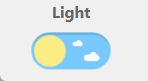

## Dark Mode Button

### Information

Toggle button to change Dark mode or White mode by adding an HTML tag to the HTML body

### Source

Used: https://github.com/cawfree/react-dark-mode-toggle by running: `npm i react-dark-mode-toggle`

### Demo
*Current demo may not reflect final iteration*

